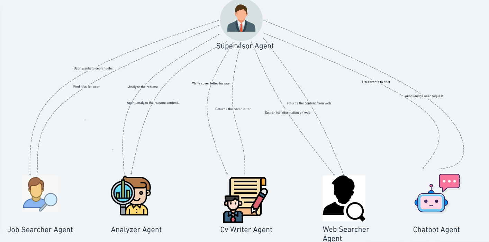

# JobNavigator-Multi-Agent
JobNavigator-Multi-Agent is a smart career assistant using a multi-agent system. Multiple agents collaborate to analyze resumes, job markets, and trends, providing personalized career advice, job matching, and path planning efficiently.

# JobNavigator: A Multi-Agent Approach



## 演示
https://github.com/user-attachments/assets/f1e191ae-19c4-48a0-b24f-dfd59bd9240a

## 需求

在当今快速变化的就业市场中，找到合适的工作并脱颖而出具有挑战性。**JobNavigator-Multi-Agent**利用 AI 技术来解决这些问题，可以：

- 根据行业、经验和地区定制化求职推荐。
- 生成突出个人优势的求职信。
- 提供潜在雇主的详细洞察。
- 通过智能多代理系统简化求职流程。

## 功能

- **个性化职位搜索：** 自动匹配符合条件的职位列表。
- **定制求职信：** 为特定职位生成量身定制的求职信。
- **公司调研：** 收集并展示潜在雇主的重要信息。
- **简历分析：** 提取并分析简历中的关键信息，优化职位匹配。
- **交互式界面：** 基于 Streamlit 构建的简洁易用的用户界面。

## 架构概览

JobNavigator基于**主管多代理架构 (Supervisor Multi-Agent Architecture)** 构建，工作原理如下：

- **主管 (Supervisor)：** 管理整体工作流程，决定下一个调用的代理。
- **职位搜索代理 (JobSearcher)：** 处理职位搜索请求并获取相关职位信息。
- **简历分析代理 (ResumeAnalyzer)：** 提取并分析上传的简历信息。
- **求职信生成代理 (CoverLetterGenerator)：** 根据简历和职位信息生成定制求职信。
- **网页调研代理 (WebResearcher)：** 执行网页搜索，收集公司信息。
- **聊天机器人 (ChatBot)：** 处理通用问题并提供对话式响应。

## 核心组件

- **代理创建与配置：** 使用通用函数为每个代理配置特定工具和提示。
- **专用工具：** 自定义工具增强代理能力，如职位搜索工具、简历提取器和网页搜索工具。
- **Streamlit 界面：** 用户界面直观且响应快速，方便与助手交互。

## 使用技术

- **LangGraph：** 用于创建和管理多代理工作流。
- **Streamlit：** 构建用户界面。
- **OpenAI API：** 利用大语言模型 (LLM)。
- **SerperClient 与 FireCrawlClient：** 提供网页搜索和爬取能力。

## 安装

1. 克隆仓库：
   ```bash
   git clone https://github.com/ht426/JobNavigator-Multi-Agent.git
   cd JobNavigator-Multi-Agent
   ```

2. 安装依赖包:
   ```bash
   pip install -r requirements.txt
   ```

3. 在`.streamlit/secrets.toml` 文件中配置环境:
   ```toml
   OPENAI_API_KEY = "your-openai-api-key"
   LANGCHAIN_API_KEY = "" 
   LANGCHAIN_TRACING_V2 = "true"
   LANGCHAIN_PROJECT = "JOB_SEARCH_AGENT"
   GROQ_API_KEY = "API key of groq"
   SERPER_API_KEY = "serper API key"
   FIRECRAWL_API_KEY = "firecrawl API key"
   LINKEDIN_JOB_SEARCH = "linkedin_api" 
   LINKEDIN_EMAIL = "" 
   LINKEDIN_PASS = ""
   DEEPSEEK_API_KEY = "deepseek_api"
   ```

4. 利用Streamlit运行代码:
   ```bash
   streamlit run app.py
   ```

## 使用方法

1. **上传简历:** 上传 PDF 格式的简历。
2. **输入查询:** 在聊天界面输入问题或任务请求（例如 “查找人工智能相关职位”）
3. **与助手互动:** 助手会引导你进行职位搜索、简历分析和求职信生成

## 未来改进

- **职位申请整合:** 直接与招聘门户集成，简化申请流程。
- **增强界面体验:** 提升 UI/UX，增加更多交互和动态元素。

## 贡献

欢迎贡献！你可以提交问题 (issues)、Fork 仓库或发送 Pull Request。

## 许可证

本项目基于 MIT 许可证。

---
